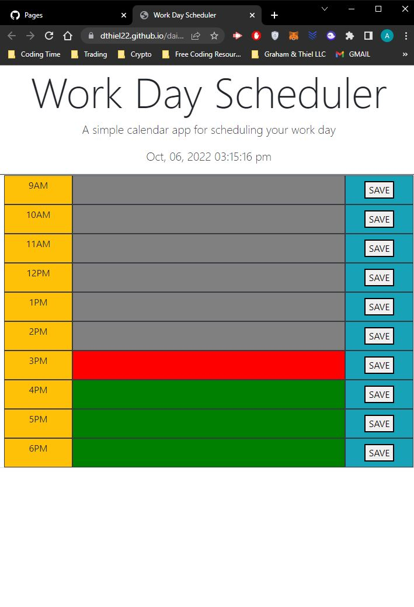
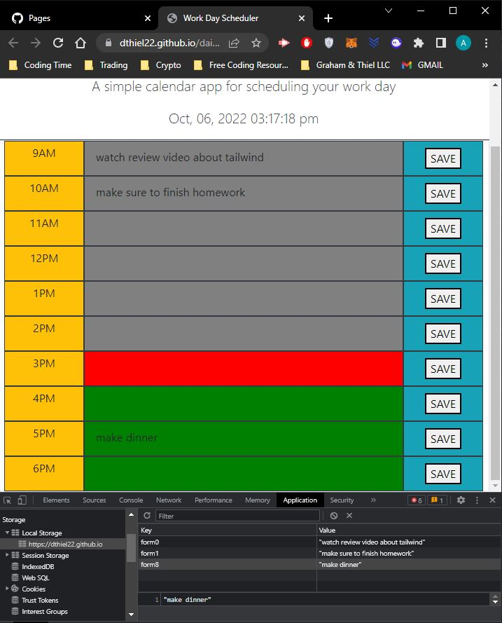
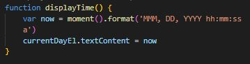
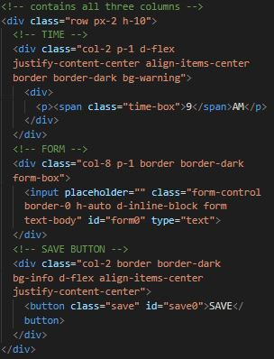
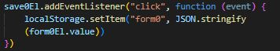
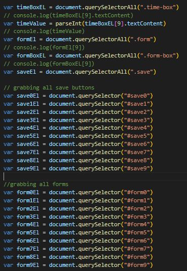
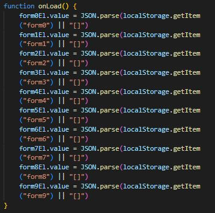
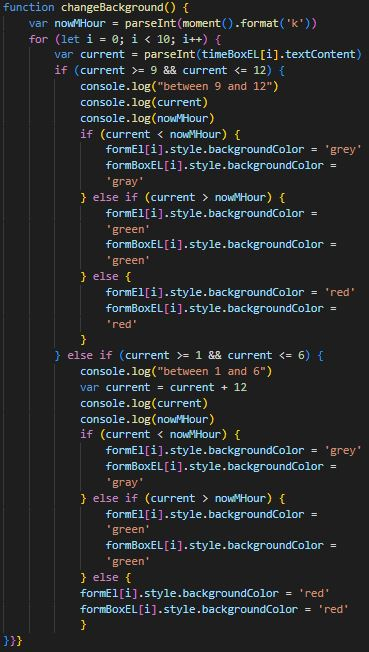

# Work Day Schedule 

## Description

This website was built for the purpose of keeping track of a daily work schedule, allowing me to become more organized and have a daily structure. The top of the page refreshes with the actual time in the day. The form zones change color based on the hour. If the current time exceeds the block time, then the areas are gray. If the current time equals the block time the zone is oragne. If the current time is less than the block time, then the zone is green

## Installation

N/A

## Usage

A user loads into the page and sees a 'Work Day Scheduler' and below it, a live clock of the current time. Each row containes the time block for the denoted time. All of the middle blocks can have added text into them.

Once the forms contain a value inputted and the save button is hit, the value is saved into local storage as individual keys. Then, when the page reloads, the forms are filled in if their corresponding key contains a value.

## Functionality

All the styling is written in bootstrap. A function was made to display the current time at the top of the page.

 Each row contained a class for the time, time div, form, form div, and the save button. These were important in comparing the current time and changing the background dinamically based on the time. 

The form and save button were given unique ids so that a click event could occur on each save button and have it correlate to it's respected form to have it be stored in local storage.

Once one row was establish, functional, and styled, I made a function to store the value in the form once the save button was clicked. Then, each row was copied and the ids were changed to the corresponding row. Variables were made to select the divs contained in the time, form, and save button along with each save button and form.

On page load, a function was performed to change the value in each form to it's corresponding key in local storage

Then a bulk of the code was on a function dictating the background color of the form div and form. The for loop only iterates 10 times sense we only have 10 rows. I set a varible equal to a value of the current military hour, allowing for easier if loops later. The first if loops starts at looking at the value stored in the time div and if it is equal to 9 to 12. If yes, then a comparison was made with the military time to see if it was larger or smaller, changing the color depending on the criteria met. The next if statement is whether the value in the time div is 1 to 6. I then added 12 to these values (to compensate for military time) and then did the same comparison as before. If this criteria wasn't met (the current hour) the background and form were turned red

## Next Update

Something to look into the future to reduce code would be to ONLY use classes instead of id's for forms and the save button. My original thought was to treat the classes as arrays so I could have a for loop. I would have a click listener on the save button class and the condition would be if it was in the following parent of the form, to save the following forms value. The save would be held in an object or array, which would be parsed, edited, stringed, and restored.

I tried to do this for the first hour of the project but it was too time consuming. Maybe another time.